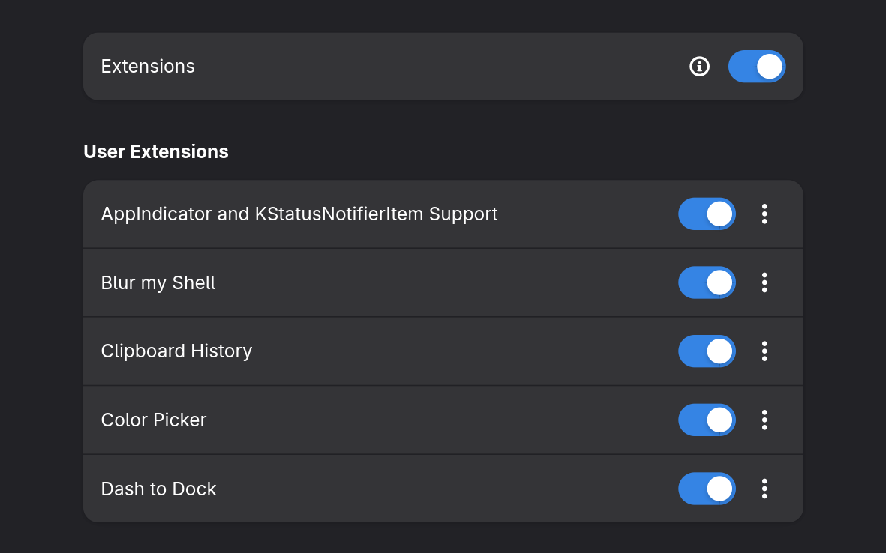

<!-- TOC start (generated with https://github.com/derlin/bitdowntoc) -->
- [My dotfiles](#my-dotfiles)
  - [How to setup a .dotfile](#how-to-setup-a-dotfile)
    - [1. Install stow:](#1-install-stow)
    - [2. Clone repository:](#2-clone-repository)
    - [3. Stow the configuration you want](#3-stow-the-configuration-you-want)
- [Guide to set up all `.dotfiles`](#guide-to-set-up-all-dotfiles)
  - [Install useful tools:](#install-useful-tools)
  - [Fonts](#fonts)
  - [Gnome things](#gnome-things)
    - [Gnome Tweaks](#gnome-tweaks)
    - [Icon Theme](#icon-theme)
    - [Extensions](#extensions)
  - [Change Workspaces Behavior](#change-workspaces-behavior)
    - [What the script does](#what-the-script-does)
    - [Run the script](#run-the-script)
  - [Kitty](#kitty)
  - [ZSH, terminal utils and theme](#zsh-terminal-utils-and-theme)
    - [Starship:](#starship)
    - [Zsh, plugins, bat, lsd:](#zsh-plugins-bat-lsd)
    - [FZF](#fzf)
      - [Basic Usage](#basic-usage)
      - [Install](#install)
    - [Stow `.dotfiles`](#stow-dotfiles)
    - [Change default **SHELL** to zsh](#change-default-shell-to-zsh)
  - [NIX](#nix)
    - [Enable flakes](#enable-flakes)
  - [Install `direnv`](#install-direnv)
    - [Better support for Nix Flakes](#better-support-for-nix-flakes)
    - [For enable:](#for-enable)
  - [GRUB](#grub)
    - [Theme](#theme)
      - [Install Distro Grub Themes](#install-distro-grub-themes)
    - [Saved last choice](#saved-last-choice)
  - [Firewall UFW](#firewall-ufw)
    - [Install](#install-1)
  - [Docker](#docker)
    - [Install docker](#install-docker)
      - [Remove script:](#remove-script)
      - [Verify the installation](#verify-the-installation)
    - [Add your user to the docker group](#add-your-user-to-the-docker-group)
  - [Eduroam](#eduroam)
    - [How to install](#how-to-install)
    - [Preventing WiFi 7 Cards from Switching to 6 GHz on Linux (ASUS Zenbook UM5606)](#preventing-wifi-7-cards-from-switching-to-6-ghz-on-linux-asus-zenbook-um5606)
      - [The fix](#the-fix)
  - [Installing IntelliJ IDEA on Linux](#installing-intellij-idea-on-linux)
  - [Fedora RPM Fusion repositories](#fedora-rpm-fusion-repositories)
    - [Install](#install-2)
<!-- TOC end -->

# My dotfiles

Now running Fedora Workstation 43 (GNOME) on an [Asus Zenbook S 16](https://wiki.archlinux.org/title/ASUS_Zenbook_UM5606) 

## How to setup a .dotfile

### 1. Install stow:

Fedora:
```bash
sudo dnf install stow -y
```

Arch Linux:
```bash
sudo pacman -S stow --noconfirm
```

Debian/Ubuntu:
```bash
sudo apt update
sudo apt install stow -y
```

### 2. Clone repository:

```bash
git clone https://github.com/alexborrazasm/dotfiles.git
cd dotfiles
```

### 3. Stow the configuration you want

For example, to install `zsh` and `nvim` configs:

```bash
stow zsh
stow nvim
```

---

# Guide to set up all `.dotfiles`

These steps assume we're using Fedora; they shouldn't be very different in other distributions.

## Install useful tools:

```bash
sudo dnf install neovim htop fastfetch
```

## Fonts

I use Cousine from [Nerd Fonts](https://www.nerdfonts.com/) 

How to install:

1. **Download the fonts .zip from [Nerd Fonts](https://www.nerdfonts.com/font-downloads)**

2. **Copy to fonts**

   ```bash
   sudo mv ~/Downloads/Cousine.zip /usr/share/fonts/
   ```

3. **Unpack the fonts**
   
   ```bash
   cd /usr/share/fonts
   sudo unzip Cousine.zip -d Cousine
   sudo rm Cousine.zip # Remove .zip
   ```

> [!NOTE]
> A Nerd Font is necessary for some terminal customization.

---

## Gnome things

### Gnome Tweaks

Use GNOME Tweaks to change fonts, adjust window behavior and customize the desktop environment.

To install:
```
sudo dnf install gnome-tweaks -y
```

### Icon Theme

Papirus Icon Theme

```bash
sudo dnf install papirus-icon-theme
```

> [!NOTE]
> After installing, open GNOME Tweaks → Appearance → Icons to select the Papirus theme.

### Extensions

To add extensions, we need to install:
```bash
sudo dnf install gnome-extensions-app -y
```



## Change Workspaces Behavior

I use a custom script to configure GNOME workspace shortcuts.

### What the script does

- Super + 1..9 → Switch to workspace 1..9

- Super + Shift + 1..9 → Move the focused window to workspace 1..9

- Disables Dock “Super + Number” shortcuts, so workspace switching works without conflicts

### Run the script
```bash
./scripts/gnome-workspaces-super.sh
```

> [!NOTE]
> If needed, run this once to make the script executable:
> `chmod +x scripts/gnome-workspaces-super.sh`

---

## Kitty

A fast, GPU-based, feature-rich terminal emulator for Linux, macOS, and 
Windows. Supports ligatures, graphics, tabs, and modern customization.

To install:
```bash
sudo dnf install kitty -y
```

*Stow* configs:
```bash
stow kitty
```

---

## ZSH, terminal utils and theme

### Starship:
```bash
sudo dnf copr enable atim/starship
sudo dnf install starship
``` 

### Zsh, plugins, bat, lsd:
```bash
sudo dnf install zsh zsh-syntax-highlighting zsh-autosuggestions bat lsd
```

> [!NOTE]
>[LSD](https://github.com/lsd-rs/lsd) (LSDeluxe) is a modern replacement for the
 traditional ls command, designed to enhance the way you view directory contents.

> [!NOTE]
>[BAT](https://github.com/sharkdp/bat) is a cat clone with syntax highlighting 
and Git integration.

The [SUDO](https://github.com/ohmyzsh/ohmyzsh/tree/master/plugins/sudo) plugin:

```bash
sudo mkdir /usr/share/zsh-sudo
sudo cd /usr/share/zsh-sudo
sudo wget https://raw.githubusercontent.com/ohmyzsh/ohmyzsh/master/plugins/sudo/sudo.plugin.zsh
```

The Extract plugin:
```bash
sudo mkdir /usr/share/zsh-extract
sudo cd /usr/share/zsh-extract
wget -O extract.plugin.zsh https://raw.githubusercontent.com/le0me55i/zsh-extract/refs/heads/master/extract.plugin.zsh

```

### FZF

[FZF](https://github.com/junegunn/fzf) is a command-line fuzzy finder that 
allows for fast and efficient searching in files, directories, and more.

#### Basic Usage

**Interactive Fuzzy Finder:**

FZF is primarily used to interactively search and select items from a list. For 
example, you can search through files, command history, and more.

- **Search through command history:**
  Pressing `Ctrl + R` allows you to search through your command history 
  interactively. As you type, FZF filters the history based on your input, 
  making it easy to find and execute previous commands.

- **Search through files (fzf-tmux integration):**
  `Ctrl + T` launches FZF in file search mode. This lets you search for files 
  and directories interactively from the current directory. If you are using 
  tmux, FZF integrates seamlessly with it.

#### Install

```bash
sudo dnf install fzf
```

### Stow `.dotfiles`

```bash
stow starship
stow zsh
```

### Change default **SHELL** to zsh

```bash
chsh -s $(which zsh)
```

> [!NOTE]
> For shell changes to take effect, it may be necessary to restart your session 
> or computer.

You can check the default SHELL:
```bash
echo $SHELL
```

---

## NIX

```bash
sudo dnf copr enable petersen/nix
sudo dnf install nix
sudo systemctl enable --now nix-daemon
```

### Enable flakes

```bash
mkdir -p ~/.config/nix
nano ~/.config/nix/nix.conf
```
And add:
```bash
experimental-features = nix-command flakes
```

## Install `direnv`

```bash
sudo dnf install direnv -y
```

### Better support for Nix Flakes

Clone on your home:
```bash
git clone https://github.com/nix-community/nix-direnv
```

And stow `.dotfiles`:
```bash
stow direnv
```

### For enable: 

Loading one `.direnv`:
```bash
direnv allow
```

## GRUB 

### Theme

I use [Distro Grub Themes](https://github.com/AdisonCavani/distro-grub-themes).

It has several flavors (Asus, Fedora, Arch).

#### Install Distro Grub Themes

1. Clone the repository:
   ```bash
   git clone https://github.com/AdisonCavani/distro-grub-themes.git
   ```

2. Create theme folder:
   ```bash
   sudo mkdir /boot/grub2/themes 
   sudo mkdir /boot/grub2/themes/fedora
   ```

3. Copy selected theme:

   In my case, the Fedora flavour.

   ```bash
   cd distro-grub-themes/themes
   sudo tar -C /boot/grub2/themes/fedora -xf fedora.tar 
   ```

4. Remove repo
   ```bash
   cd
   rm -rf distro-grub-themes
   ```

5. Configure GRUB

   ```bash
   sudo vi /etc/default/grub
   ```

   Add these lines:
   ```
   GRUB_TERMINAL_OUTPUT="gfxterm"
   GRUB_GFXMODE=1600x1200
   GRUB_THEME="/boot/grub2/themes/fedora/theme.txt"
   ```

   And update grub config:
   ```bash
   sudo grub2-mkconfig -o /boot/grub2/grub.cfg
   ```

> [!WARNING]
> Replace `1600x1200` with your desired screen resolution.
> Im my native screen resolution is `2880x1800` but use smaller one to have 
> larger fonts

### Saved last choice

In Fedora 43 it comes configured by default if not edit:
```bash
sudo vi /etc/default/grub
```

And add or modify:
```bash 
GRUB_DEFAULT=saved
GRUB_SAVEDEFAULT=true
```

Finally, update grub config:
```bash
sudo grub2-mkconfig -o /boot/grub2/grub.cfg
```

## Firewall UFW

### Install 
```bash
sudo dnf install ufw
sudo ufw enable
```

## Docker

I use [this script](https://github.com/docker/docker-install).

### Install docker
```bash
curl -fsSL https://get.docker.com -o get-docker.sh
sh get-docker.sh 
sudo systemctl enable docker --now 
```
#### Remove script:
```bash
rm get-docker.sh 
```

#### Verify the installation

Check Docker version:
```bash
docker --version
```

Test Docker:
```bash
docker run hello-world
``` 

If you see the “Hello from Docker!” message, everything is working correctly.

### Add your user to the docker group
This allows you to run docker without typing sudo every time:
```bash
sudo usermod -aG docker $USER
``` 

## Eduroam

### How to install

1. Download the installer for your university from [cat eduroam](https://cat.eduroam.org/).

2. Open a terminal and run:
   ```bash
   python3 Downloads/eduroam-linux-UdC-eduroam.py
   ```

3. Follow the prompts to install and connect.

### Preventing WiFi 7 Cards from Switching to 6 GHz on Linux (ASUS Zenbook UM5606)

The Mediatek MT7925 WiFi card (build on my Asus laptop) supports 6 GHz 
(WiFi 6E / 7). On Linux, it may try to connect using 6 GHz, even if the network
(like Eduroam) only uses 2.4 GHz or 5 GHz.

This causes:

- Dropped connections
- Failed authentication
- Unstable network

#### The fix

Force the connection to `5 GHz` only using NetworkManager.
```bash
nmcli connection modify "eduroam" wifi.band a
```
What it does:
- Enables 5 GHz only
- Disables 2.4 GHz
- Automatically blocks 6 GHz

This prevents the MT7925 from trying 6 GHz and keeps your connection stable.

> [!NOTE]
> It's probably not the best solution, but it works.

## Installing IntelliJ IDEA on Linux

1. Download it from [here](https://www.jetbrains.com/idea/download/?section=linux).

2. Extract it to /opt:

   ```bash
   cd ~/Downloads
   sudo tar -xzf idea*.tar.gz -C /opt/
   sudo mv /opt/idea* /opt/idea
   ```
   
3. Create a symbolic link so it’s available in your PATH:

   ```bash
   sudo ln -s /opt/idea/bin/idea.sh /usr/local/bin/idea
   ```

4. Create a `.desktop` file to have a shortcut and icon:

   ```bash
   mkdir -p ~/.local/share/applications

   cat << 'EOF' > ~/.local/share/applications/idea-ultimate.desktop
   [Desktop Entry]
   Version=1.0
   Type=Application
   Name=IntelliJ IDEA Ultimate
   Icon=/opt/idea/bin/idea.png
   Exec="/usr/local/bin/idea"
   Comment=Capable & Ergonomic IDE for JVM
   Categories=Development;IDE;
   Terminal=false
   StartupWMClass=jetbrains-idea
   EOF
   ```

## Fedora RPM Fusion repositories

RPM Fusion provides additional packages that are not shipped by Fedora by default
(due to licensing or patent restrictions). Many commonly used applications
(multimedia codecs, proprietary drivers, etc.) depend on these repositories.

[Webpage](https://rpmfusion.org/Configuration#Installing_Free_and_Nonfree_Repositories).

### Install

Enable both **Free** and **Nonfree** RPM Fusion repositories by running:

```bash
sudo dnf install -y \
  https://download1.rpmfusion.org/free/fedora/rpmfusion-free-release-$(rpm -E %fedora).noarch.rpm \
  https://download1.rpmfusion.org/nonfree/fedora/rpmfusion-nonfree-release-$(rpm -E %fedora).noarch.rpm
```